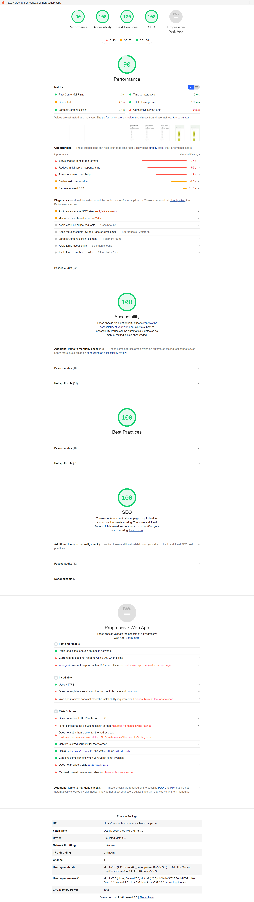

# SpaceX-PS
A basic App to view all the projects done by SpaceX using technoligies like NodeJS, Javascript and EJS. In this project, there are quite a few good functionalities to learn like <b>Server Side Rendering, API Rendering, EJS Templating, and Filters like major E-Commerce i.e Myntra</b>

<b>Some of the Major technologies used:</b>
1. <a href="https://nodejs.org/" target="_blank">NodeJS</a>
2. <a href="https://expressjs.com/" target="_blank">ExpressJS</a>
3. <a href="https://javascript.info/" target="_blank">JavaScript</a>
4. <a href="https://ejs.co/" target="_blank">EJS Templating</a>

Prerequisites to run the app in local environment
1. Installed NodeJS

<b>Step 1:</b>
Initialize npm and get all the reuired npm packages for the project.

<b>Congratulations!</b> You are good to GO now.

<b>Lighthouse Score</b>

Ping me at https://www.linkedin.com/in/prashant-kumar-2124b3b4/
if any of you have any questions, suggestions, feedback or just want to say Hi:)
